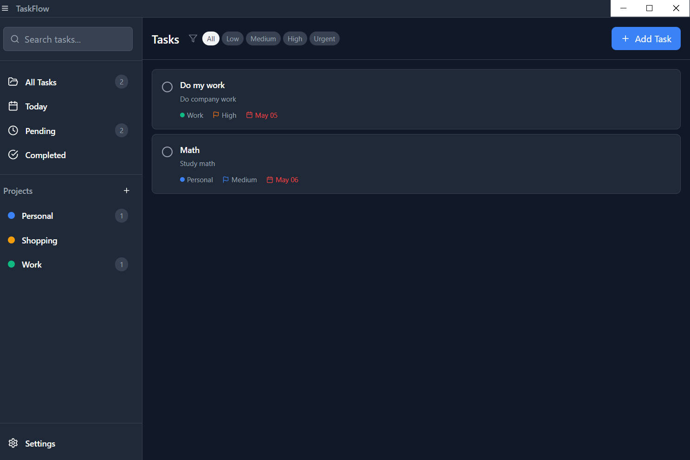
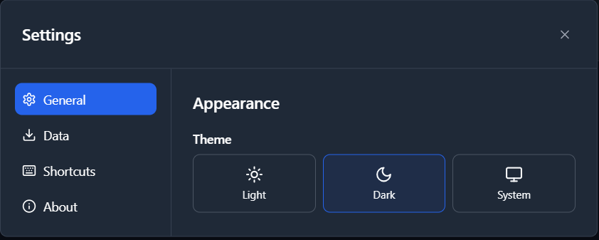
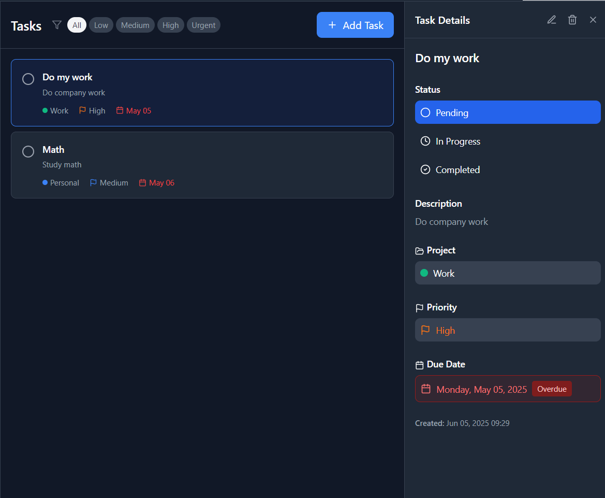

# 📋 TaskFlow - Modern Desktop Task Management

A beautiful, modern desktop task management application built with Electron, React, and TypeScript. TaskFlow helps you organize your tasks, projects, and productivity with an intuitive interface and powerful features.

## 📸 Screenshots

### Light Theme


### Dark Theme


### Task Management


## ✨ Features

### 🎯 **Smart Task Management**
- Create, edit, and organize tasks with rich descriptions
- Set priority levels (Low, Medium, High, Urgent)
- Track task status (Pending, In Progress, Completed)
- Due dates with overdue detection
- Quick task creation and editing

### 📁 **Project Organization**
- Group tasks into color-coded projects
- Filter tasks by project, status, or priority
- Visual project indicators and task counts

### 🔍 **Advanced Filtering & Search**
- Real-time search across all tasks
- Filter by status, priority, and project
- Smart task organization and sorting

### 🎨 **Modern UI/UX**
- Clean, minimal design with Tailwind CSS
- Dark and light theme support
- Responsive layout with collapsible sidebar
- Smooth animations and micro-interactions
- Native-feeling desktop experience

### 💾 **Offline-First**
- Local SQLite database for reliability
- No internet required
- Fast performance with local data storage

## 🚀 Getting Started

### Prerequisites
- [Node.js](https://nodejs.org/) (v16 or higher)
- [npm](https://www.npmjs.com/) or [yarn](https://yarnpkg.com/)

### Installation

1. **Clone or download this project**
   ```bash
   # If you have the source code, navigate to the project directory
   cd TaskFlow
   ```

2. **Install dependencies**
   ```bash
   npm install
   ```

3. **Start the development server**
   ```bash
   npm run dev
   ```

4. **Build for production**
   ```bash
   npm run build
   npm run make
   ```

## 🛠️ Development

### Project Structure
```
src/
├── main.ts                 # Electron main process
├── renderer.tsx            # React app entry point
├── preload.ts             # Electron preload script
├── components/            # React components
│   ├── layout/           # Layout components
│   ├── task/            # Task-related components
│   └── project/         # Project components
├── stores/              # Zustand state stores
├── services/            # Database and API services
└── styles/             # Global styles
```

### Available Scripts

- `npm run dev` - Start development server
- `npm run build` - Build for production
- `npm run make` - Create distributable packages
- `npm run lint` - Run ESLint
- `npm test` - Run tests

### Technology Stack

- **Desktop Framework**: Electron
- **Frontend**: React 18 + TypeScript
- **Styling**: Tailwind CSS
- **UI Components**: Radix UI primitives
- **Icons**: Lucide React
- **State Management**: Zustand
- **Database**: SQLite (better-sqlite3)
- **Build Tool**: Webpack
- **Package Manager**: npm

## 📊 Database Schema

### Tasks Table
- `id` - Unique identifier
- `title` - Task title
- `description` - Optional description
- `project_id` - Reference to project
- `priority` - Priority level (0-3)
- `status` - Task status (pending, in_progress, completed)
- `due_date` - Optional due date
- `created_at` - Creation timestamp
- `updated_at` - Last update timestamp
- `completed_at` - Completion timestamp

### Projects Table
- `id` - Unique identifier
- `name` - Project name
- `color` - Project color code
- `created_at` - Creation timestamp

## 🎨 Customization

### Themes
TaskFlow supports both light and dark themes. The theme preference is automatically saved and restored.

### Colors
Project colors can be customized from a predefined palette. The color system is built on CSS custom properties for easy theming.

## 🤝 Contributing

1. Fork the repository
2. Create your feature branch (`git checkout -b feature/AmazingFeature`)
3. Commit your changes (`git commit -m 'Add some AmazingFeature'`)
4. Push to the branch (`git push origin feature/AmazingFeature`)
5. Open a Pull Request

## 📝 License

This project is licensed under the MIT License - see the [LICENSE](LICENSE) file for details.

## 🙏 Acknowledgments

- [Electron](https://www.electronjs.org/) for the desktop framework
- [React](https://reactjs.org/) for the UI framework
- [Tailwind CSS](https://tailwindcss.com/) for styling
- [Radix UI](https://www.radix-ui.com/) for accessible components
- [Lucide](https://lucide.dev/) for beautiful icons

## 📞 Support

If you have any questions or need help, please open an issue on GitHub.

---

**Built with ❤️ for productivity enthusiasts**
